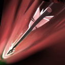

# 射手天赋

卓尔游侠的战斗经验使她有概率发出极其精准高效的箭矢。箭矢将造成基于她攻击力的额外伤害。可用神杖升级。

Drow's experiences in battle grant her a chance to launch arrows with incredible accuracy and effectiveness. Dealing additional damage based on her Attack Damage.Upgradable by Aghanim's Scepter.

**1X触发几率**：15%/22%/30%

**2X触发几率**：10%/15%/20%

**3X触发几率**：5%/7%/10%

**敏捷加成**：20/40/60

**分裂箭矢搜索范围**：0（神杖 375）

**最多分裂目标**：0 （神杖 2）

**分裂伤害减免**：0（神杖 50%）

**伤害类型**：纯粹

**无视魔法免疫**：是

**可用神杖升级**：是

