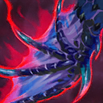

# 狂战士之血

哈斯卡的伤痛赐予他力量，根据他损失的生命值将获得攻击速度和生命恢复加成。生命恢复为力量的一定百分比。

Huskar's injuries feed his power, giving increased attack speed and health regen based on missing health. Health regen is a percentage of your strength.

**最高攻击速度加成**：160/220/280/340

**最高魔法抗性加成**：20%/30%/40%/50%

**力量最高生命恢复加成**：20%/40%/60%/80%

**最高加成生命值阈限**：10%

**Max Attack Speed Bonus**: 220/260/300/340

**Max Magic Resistance Bonus**: 20%/30%/40%/50%

**Strength as Max Health Regen Bonus**: 20%/40%/60%/80%

**Max Bonus Health Threshold**: 10%

