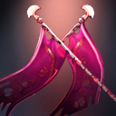

# 决斗

军团指挥官强制与目标进行决斗，持续短暂的数秒。决斗开始后双方只能进行物理攻击，不能使用任何物品和技能。如果目标在决斗期间死亡，本技能将会刷新冷却时间。可用神杖升级。

Legion Commander and the target enemy are forced to attack each other for a short duration.  Neither can use items or abilities.  If either target dies during the duration, its cooldown is reset.Upgradable by Aghanim's Scepter.

**神杖升级**：提高决斗的持续时间，军团指挥官在决斗过程中处于技能免疫状态。

**施法距离**：150

**攻击力加成**：60%/80%/100%

**攻击速度加成**：100/200/300

**护甲加成**：6/12/18

**神杖升级状态抗性**：100%

**持续时间**：4/6/8

**神杖升级持续时间**：6/8/10

**冷却时间**：50

**魔法消耗**：75

**无视魔法免疫**：是

**能否被驱散**：否

