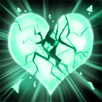

# 竭心光环

每 `1.0` 秒，对附近的敌人造成伤害。伤害是基于你的智力。

Every `1.0` seconds, damages every enemy nearby. The damage is based on your intelligence.

**范围**：800

**基础伤害**：10/20/30/40

**智力额外伤害**：50%/80%/110%/140% 

**每击杀英雄叠加数量**：6

**每击杀非英雄叠加数量**：1

**每层生命恢复加成**：2/3/4/5

**每层魔法恢复加成**：3/4/5/6

**叠加持续时间**：7

**伤害类型**：纯粹

**无视魔法免疫**：是

*只对视野内的敌人有效。*

