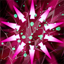

# 尖刺外壳



激活状态下，尖刺外壳可以反弹司夜刺客受到的伤害，同时眩晕攻击者。\n\n钻地状态下尖刺外壳施放后将立刻眩晕周围的敌人。

When activated while above ground, Spiked Carapace reflects damage dealt to Nyx Assassin, as well as stunning the source of the damage. \n\nWhile Burrowed, Spiked Carapace instantly stuns nearby enemies when cast.

**施法动作**：0

**眩晕时间**：0.1 0.2 0.3 0.4

**眩晕间隔**：4

**伤害减免**：20%

**反弹伤害**：80% 100% 120% 140%

**冷却时间**：5

**每秒魔法消耗**：1% 2% 3% 4%

**伤害类型**：受到的实际伤害相同类型

**无视魔法免疫**：否


```lua
//=================================================================================================================
	"npc_dota_hero_nyx_assassin"			//  司夜刺客（小强）
	//=================================================================================================================
	{
		"override_hero"			"npc_dota_hero_nyx_assassin"

		"Ability3"				"mjz_nyx_assassin_spiked_carapace"
	}
```

