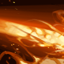

# 烈日炙烤

凤凰以损失生命能量为代价，向前射出一束炽热的光线炙烤敌人。光线对敌人造成伤害，并且能治疗友军，伤害和治疗的数值均为基础数值加上凤凰生命值的一定百分比。随着光线不断炙烤，造成的伤害也会不断增加。

Phoenix expels a beam of light at the cost of its own health. The beam damages enemies and heals allies for a base amount plus a percentage of Phoenix health. The percentage increases as the beam continues to fire.

**施法动作**：0.01+0.5

**施法距离**：1300

**光线长度**：1250

**光线范围**：130

**每秒当前生命值消耗**：6%/7%/8%/9%

**每秒基础伤害**：14/20/26/32

**每秒最大生命值伤害**：1%/3%/5%/7% （天赋 +2%）

**每秒基础治疗**：7/10/13/16

**每秒最大生命值治疗**：0.6%/1.2%/1.8%/2.5%

**每秒转身速率（角度）**：25

**持续时间**：10

**冷却时间**：26

**魔法消耗**：0

**无视魔法免疫**：否

**能否驱散**：否

