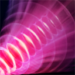

# 超声冲击波

撕裂一个敌方单位，将其折磨得死去活来，并造成巨大伤害。每次成功击杀英雄都会提升威力。可用神杖升级。

**施法距离**：700

**声波最大范围**：450

**伤害**：340/439/520

**神杖升级伤害**：390/500/610

**智力伤害**：100%/200%/300%

**冷却时间**：30/20/10

**魔法消耗**：最大魔法值60%

**伤害类型**：纯粹

**无视魔法免疫**：是

