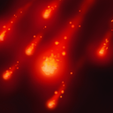

# 照明火箭

向目标区域发射照明弹，对区域内敌人造成伤害并提供1秒的视野。

Fires a flare that explodes over a given area, damaging enemies and providing vision for 1 seconds.

**施法动作**：0.3+0

**施法距离**：1000

**范围**：600

**伤害**：80/120/160/200 (天赋 +125)

**视野持续时间**：1

**冷却时间**：16/14/12/10

**魔法消耗**：35/40/45/50

**伤害类型**：魔法

**无视魔法免疫**：否

