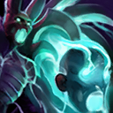

# 魂断

隔断恐怖利刃以及目标的灵魂并将双方的当前血量进行互换。交换后双方的生命值必定在一定百分比以上。

Severs the life from both Terrorblade and a target, exchanging a percentage of both units' current health. Some health points must remain.

**施法动作**：0.35+0.83

**施法距离**：475

**最低生命值**：25%/30%/35%

**冷却时间**：120/80/40 （天赋 85/45/5）

**魔法消耗**：200/100/50

**无视技能免疫**：是

