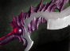

## 深渊之刃 系列

名称：深渊之刃 系列

效果：

​	主动：**强击**

​			闪烁至敌方目标身旁并造成击晕，持续2秒。

​			无视技能免疫。  

​			**施法距离**：600 700 800 900 1000

​			**眩晕时间**：2

​	被动：**重击**

​	近战英雄的攻击有25%的概率击晕目标1.5秒并额外造成100点伤害。远程英雄的击晕概率为10%。

​	**触发几率(近战)**：25%

​	**触发几率(远程)**：10%

​	**伤害（魔法）**：100 110 120 130 150

​	**眩晕时间**：1.5

​	**冷却时间**：2.3

升级合成素材：秘银锤（1600） + 活力之球（1100）+ 卷轴（1750） = 4450

| 深渊之刃 系列     | LVL 1 |     LVL 2     |     LVL 3     |     LVL 4     |     LVL 5     |
| ----------------- | :---: | :-----------: | :-----------: | :-----------: | :-----------: |
| 价格              | 6625  |     11075     |     15525     |     19975     |     24425     |
| + 攻击力          |  25   |      50       |      75       |      100      |      125      |
| + 力量            |  10   |      10       |      10       |      10       |      10       |
| + 生命值          |  250  |      500      |      750      |     1000      |     1250      |
| + 生命恢复        |  10   |      10       |      10       |      10       |      10       |
| 重击 几率（近战） |  25%  |      26%      |      27%      |      28%      |      29%      |
| 重击 几率（远程） |  10%  |      11%      |      12%      |      13%      |      14%      |
| 重击 伤害（魔法） |  100  |      110      |      120      |      130      |      150      |
| 重击 眩晕时间     | 1.50  |     1.50      |     1.50      |     1.50      |     1.50      |
| 重击 冷却时间     | 2.30  |     2.30      |     2.30      |     2.30      |     2.30      |
| 合成              |       | LVL 1 + LVL 1 | LVL 2 + LVL 1 | LVL 3 + LVL 1 | LVL 4 + LVL 1 |

